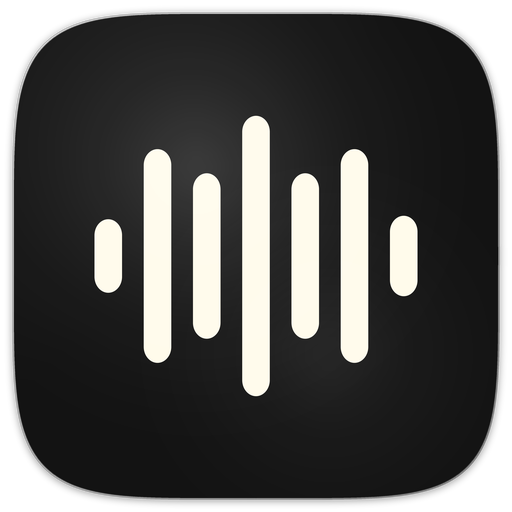

<p align="center">
  
</p>

<h1 align="center">Wispah Flow</h1>

<p align="center">
  Free, open source voice-to-text for macOS. Press a hotkey, speak, and your words appear at the cursor — adapted to what's on screen.
</p>

<p align="center">
  <a href="https://github.com/idanyekutiel/wispah/releases/latest/download/Wispah.dmg"><b>Download Wispah.dmg</b></a><br>
  <sub>macOS 13+ &middot; Apple Silicon + Intel</sub>
</p>

---

## Features

- **Context-aware transcription** — takes a screenshot when you start recording, then uses it to get names, terminology, and formatting right. Replying to an email? It'll spell the person's name correctly. Writing code? It'll match the syntax.
- **Two recording modes** — hold-to-record (push-to-talk style) and toggle (press to start, press to stop), each with its own hotkey
- **Live recording overlay** — floating pill with waveform visualization, state transitions, and a smooth slide-to-notch animation
- **Paste at cursor** — transcription goes straight to wherever your cursor is, with smart leading-space detection so it doesn't smash into existing text
- **Transcription history** — searchable log of every transcription with audio playback
- **Usage stats** — words transcribed, recording time, streaks, words per minute
- **Auto-updates** — checks GitHub Releases in the background with a 3-day stability buffer. Downloads the DMG, replaces the app, and relaunches — all with one click.
- **Pause media while recording** — optionally pauses music/video during recording, resumes when done. Uses [mediaremote-adapter](https://github.com/ungive/mediaremote-adapter) to work around Apple's macOS 15.4+ MediaRemote restrictions.
- **Privacy-first** — no servers, no accounts, no telemetry. The only network calls are to Groq's API. Audio is processed and discarded, nothing stored externally.

## Why Groq

Wispah Flow uses [Groq](https://groq.com) for both transcription (Whisper) and post-processing (LLM). Two reasons:

1. **It's free.** Groq offers free API access, so using Wispah Flow costs nothing. No subscription, no credits, no hidden limits that matter for normal use. Just grab an API key and go.
2. **It's fast.** Groq runs on custom LPU hardware designed for inference speed. Transcriptions come back near-instantly, making the whole flow feel like native dictation.
3. **It's what we inherited.** Wispah Flow is a fork of FreeFlow, which was built on Groq from the start. It works well, so we kept it — and plan to add local model support down the road.

## Setup

1. Download from [Releases](https://github.com/idanyekutiel/wispah/releases)
2. Get a free API key at [console.groq.com](https://console.groq.com)
3. Open the app and follow the setup wizard

The wizard walks you through granting permissions (microphone, accessibility, screen recording) and configuring your hotkeys.

## Build from source

```bash
git clone https://github.com/idanyekutiel/wispah.git
cd wispah

make watch        # Dev build + auto-rebuild on changes
make dev          # One-shot dev build
make dev-run      # Build and launch

ARCH=universal make all   # Release build (universal binary)
make dmg                  # Create DMG installer
```

Requires Xcode Command Line Tools and fswatch (`brew install fswatch`).

No Xcode project — compiles with `swiftc` directly via Makefile.

## Roadmap

- [ ] Local model support — run transcription and post-processing on-device instead of requiring Groq

## Privacy

No servers, no accounts, no tracking. The only network calls are to Groq's API for transcription and context processing. Audio is processed and discarded — nothing is stored or retained externally.

## Credits

Wispah Flow is a fork of [FreeFlow](https://github.com/zachlatta/freeflow) by [Zach Latta](https://github.com/zachlatta). Original project licensed under MIT.

## License

MIT License. See [LICENSE](LICENSE).

Third-party dependencies are listed in [THIRD_PARTY_LICENSES.md](THIRD_PARTY_LICENSES.md).
